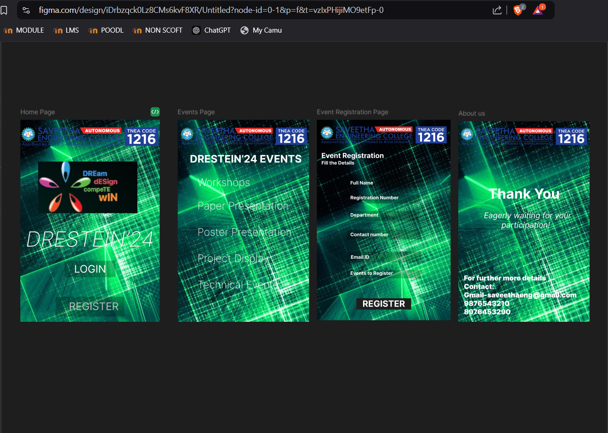

# Ex09 Event Registration Web Application
## Date:19.12.2024

## AIM:
To design, develop and deploy a web application for event registration.

## DESIGN STEPS:

### Step 1:
Create a new frame.

### Step 2:
Select any one preset size of your choice.

### Step 3:
Select the shapes you need.

### Step 4:
Import images as needed.

### Step 5:
Create pages based on your need and link them.

### Step 6:

Validate the HTML and CSS code.

### Step 6:

Publish the website in the given URL.

## DESIGN TOOL:
Figma

## CODE:
```
Home Page 
<div class="home-page">
  
  <div class="logo-1"></div>
  
  
  <div class="drestein-24">DRESTEIN’24</div>
  <div class="rectangle-1"></div>
  <div class="login">LOGIN</div>
  <div class="register">REGISTER</div>
  <div class="rectangle-2"></div>
</div>

Events Page
<div class="events-page">
  
  <div class="drestein-24-events">DRESTEIN’24 EVENTS</div>
  <div class="workshops">Workshops</div>
  <div class="paper-presentation">Paper Presentation</div>
  <div class="poster-presentation">Poster Presentation</div>
  <div class="project-display">Project Display</div>
  <div class="technical-events">Technical Events</div>
  
  
  
</div>

Event Registration Page
<div class="event-registration-page">
  
  <div class="rectangle-5"></div>
  <div class="department">Department</div>
  <div class="rectangle-4"></div>
  <div class="registration-number">Registration Number</div>
  
  <div class="event-registration">Event Registration</div>
  <div class="fill-the-details">Fill the Details</div>
  <div class="rectangle-3"></div>
  <div class="full-name">Full Name</div>
  <div class="rectangle-6"></div>
  <div class="contact-number">Contact number</div>
  <div class="rectangle-7"></div>
  <div class="email-id">Email ID</div>
  
  <div class="events-to-register">Events to Register</div>
  <div class="rectangle-9"></div>
  <div class="register">REGISTER</div>
</div>

About us
<div class="about-us">
  
  
  <div class="thank-you">Thank You</div>
  <div class="eagerly-waiting-for-your-participation">
    Eagerly waiting for your
    <br />
    participation!
  </div>
  <div
    class="for-further-more-details-contact-gmail-saveethaeng-gmail-com-9876543210-8976453290"
  >
    For further more details
    <br />
    Contact:
    <br />
    Gmail-saveethaeng@gmail.com
    <br />
    9876543210
    <br />
    8976453290
  </div>
</div>
```


## OUTPUT:



## RESULT:
The program to design, develop and deploy a web application for event registration is completed successfully.
